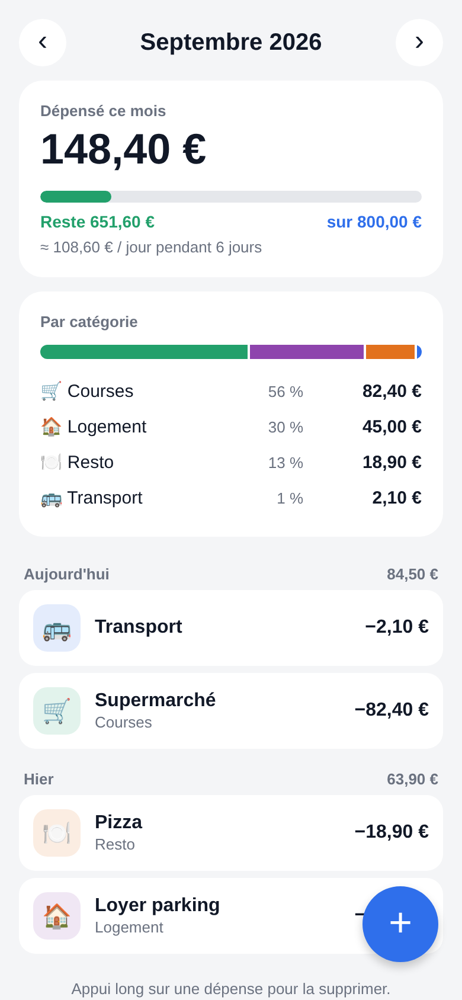

# Budget 💶



Petite appli Expo pour suivre ses dépenses au quotidien.

- Ajout rapide d'une dépense (montant, description, catégorie, aujourd'hui / hier / avant-hier)
- Total du mois et navigation mois par mois
- Budget mensuel avec barre de progression (vert → orange à 80 % → rouge en dépassement)
  et montant restant **par jour** jusqu'à la fin du mois
- Répartition par catégorie (barre empilée + pourcentages)
- Historique groupé par jour ; appui long pour supprimer
- Données enregistrées sur l'appareil (AsyncStorage), aucun compte requis

## Lancer

```bash
npm install
npx expo start      # puis scanner le QR code avec Expo Go
npx expo start --web
```

## Structure

```
App.tsx                         écran principal
src/components/AddExpenseModal  saisie d'une dépense
src/components/BudgetModal      réglage du budget mensuel
src/storage.ts                  persistance (hook useData)
src/categories.ts, format.ts    catégories, formatage € et dates
```
